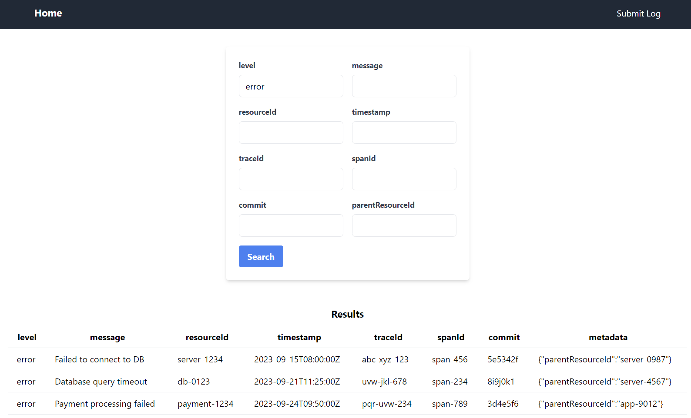
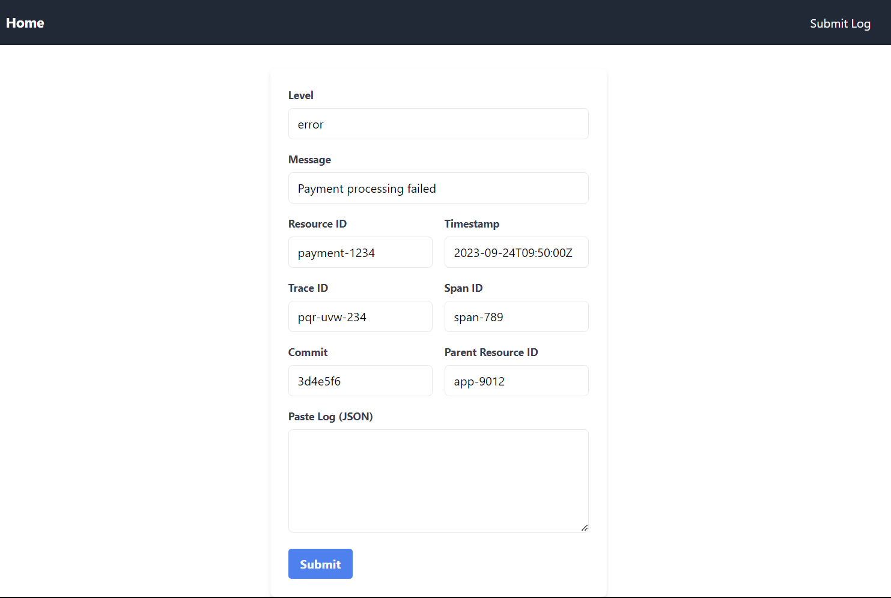
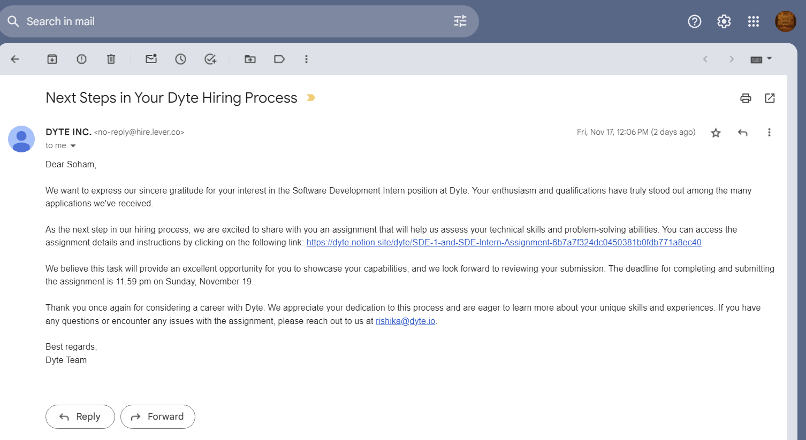

# Log Ingestor
A log ingestor and query interface system that can efficiently handle vast volumes of log data, and offer a simple interface for querying this data using full-text search or specific field filters.

## Setup locally:

### Requirements:
    - Go
    - npm
    - MongoDB

- clone this repo and cd into it

- start frontend:
```bash 
cd frontend
npm install
npm run dev
```

- start backend:
```bash
cd backend
go get -d ./...
go run main.go
```

- setup mongodb:
    - enter credentials in `backend/example.env` file and rename it to .env

## System Design:
### Frontend:
- React.js with TypeScript, React Router, React hook form, Axios, Vite
- TailwindCSS for styling

### Backend:
- Go: blazing fast, simple, and efficient language for creating web servers.
- Gorilla Mux: URL router and dispatcher for matching incoming requests to their respective handler.
- MongoDB: NoSQL Database for storing log data.

### Database Schema:
- The database schema is very simple, it consists of a single collection.
- Each log document has the following fields:
    ```ts
    type Log = {
        id: string;
        level: string;
        message: string;
        resourceId: string;
        timestamp: string;
        traceId: string;
        spanId: string;
        commit: string;
        metadata: {
            parentResourceId: string;
        };
    };
    ```

### API Endpoints:
- GET /logs: returns logs that match the specified filters
    - filters: an object that contains the filters to apply to the logs
    - example:
    - /logs?message=payment
    - /logs?level=error&message=payment&spanId=span

- POST /submitlog : adds a new log

## Search is implemented using regular expressions.
- The search query can also contain filters, which are applied to the logs before searching for the query.

## Improvements:
- Database: we can use a SQL database like PostgreSQL, which will make it easier to query the data, as we can use SQL queries instead of using regular expressions.
- frontend: adding more features like pagination, sorting, time range filters, etc.
- the backend: adding more endpoints, like get all logs, get logs by level, get logs by timestamp, etc.
- We can also use ElasticSearch for searching logs, which is a very powerful search engine.
- caching can be added to the frontend using redux, etc., to improve performance and reduce the number of requests to the backend.
- we can also add authentication and authorization to the backend, to make sure that only authorized users can see some logs, etc.

## Screenshots:



## screenrecording:


Job Application:


## I'll be hosting the frontend on Vercel, and for the backend I will do the following:
- Using linode or digitalocean, have a linux server, and install docker on it.
- Run a docker container with the backend code, and use nginx as a reverse proxy.

### I'll be happy to answer any questions you have, and I'm looking forward to hearing from you soon.
mail: sohamdatta34@gmail.com

phone: +91 8860571693